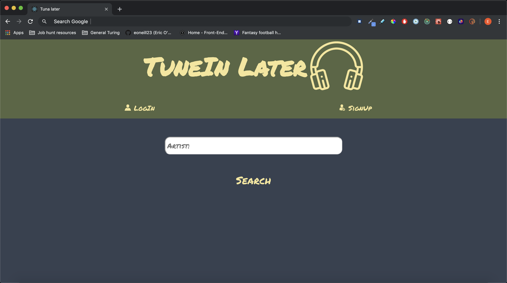
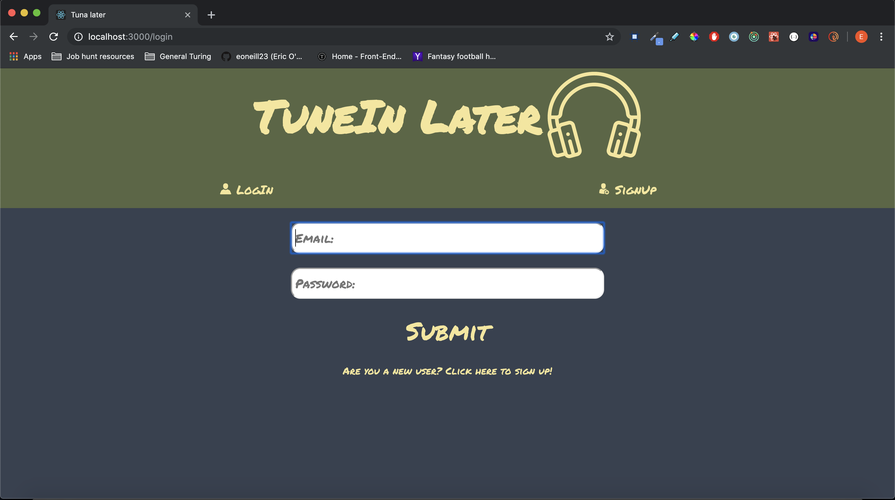
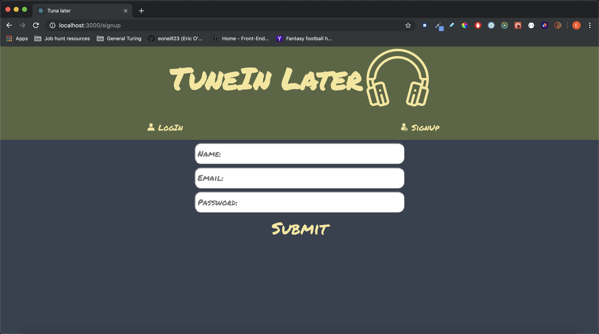
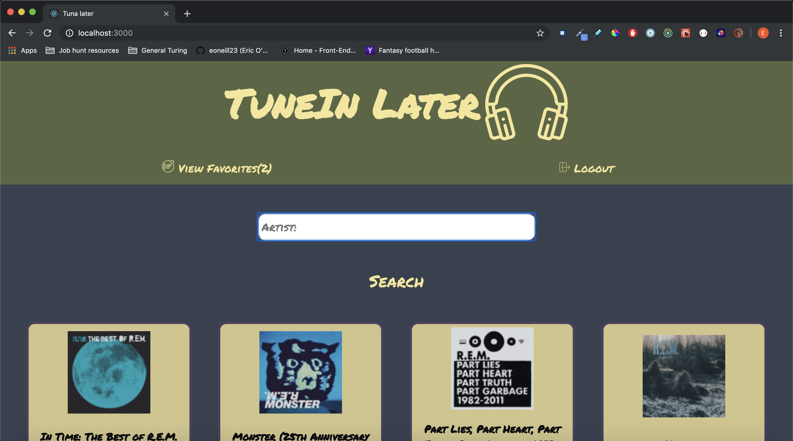
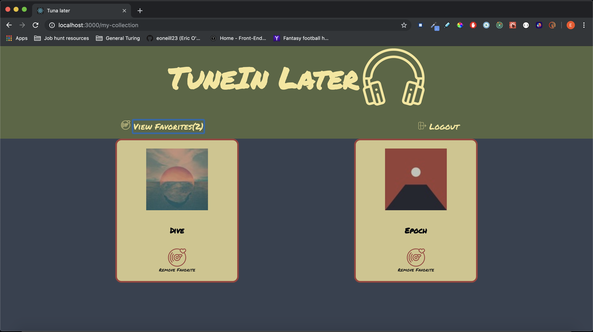

# Tune In Later

## Authors:
* Eric O'Neill ([eoneill23](https://github.com/eoneill23))
* Ann Cerveny ([CervAnn](https://github.com/CervAnn))
* Jon O'Drobinak ([TripleManus](https://github.com/Triplemanus))

## Overview
Tune In Later is a web application that allows users to search for different artists' albums via the [Itunes Search API](https://developer.apple.com/library/archive/documentation/AudioVideo/Conceptual/iTuneSearchAPI/index.html#//apple_ref/doc/uid/TP40017632-CH3-SW1).

In addition to searching for music from different artists, users can also log in, log out, create a new account, and "favorite" albums to view them at a later time.

## Getting started
* Clone down the repo and install the dependencies with `npm install`.
* Run `npm start` and visit http://localhost:3000 to view the application in the browser.
* Run the test suite with `npm test`.

## Learning goals
* Make informed design decisions to create a user-friendly application.
* Become comfortable with different network requests like GET, POST, & DELETE.
* Solidify concepts with React to create clean and re-useable components.
* Become comfortable with Redux’s lifecycle, creating actions, reducers, and connecting them to React components.
* Understand and solidify concepts with React component, asynchronous code, route handling, and Redux testing.

## Built with
  * React (`create-react-app`)
  * React Router
  * Functional React components
  * Class React components
  * Redux
  * Testing Jest/Enzyme
  * CSS
  * Fetch API
  * Itunes Search API

## Images

### Home page:

### Log-in form:

### Signup form:

### Logged-in home page:

### Favorites page:

